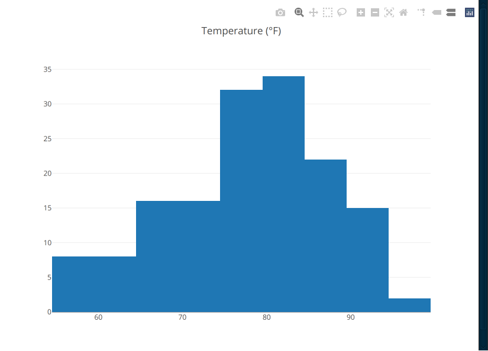
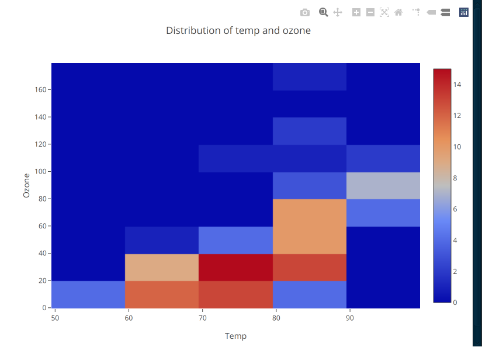
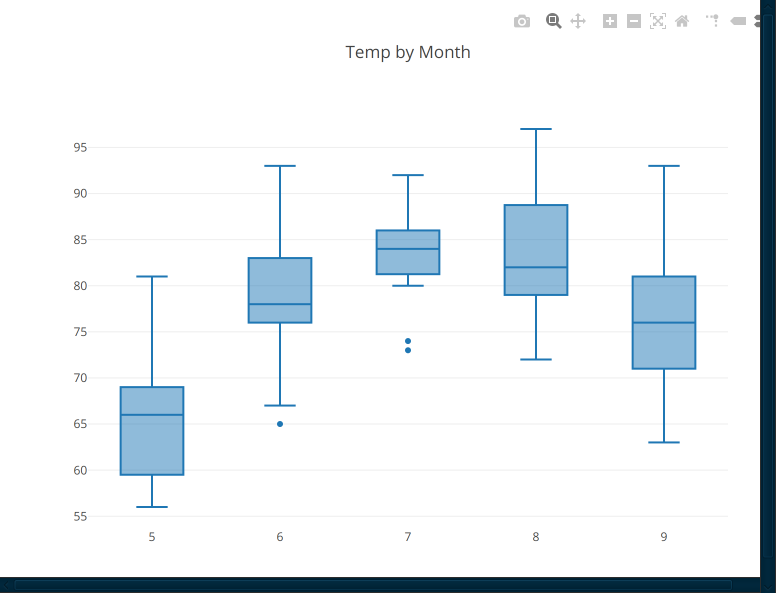
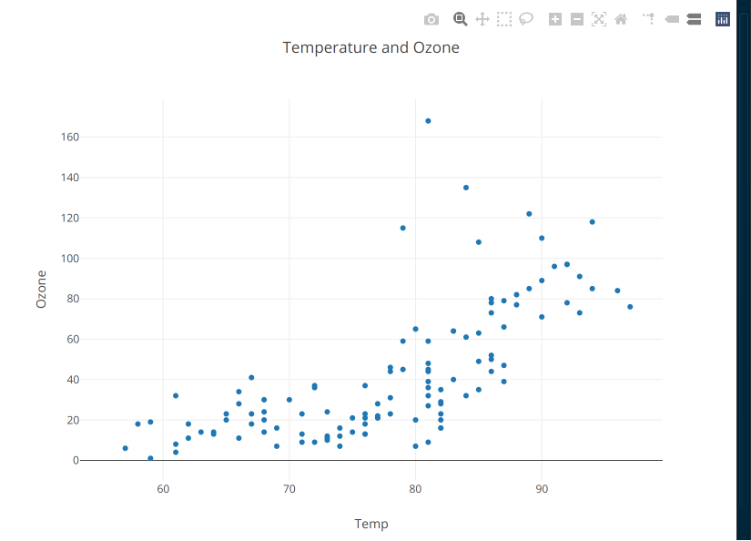

# Gade cookbook

Gade is an integrated analytics development environment meant to aid you in the process of
gathering data, extract information from that data and transform that information into knowledge.

A lot of the inspiration for writing this cookbook is drawn from Paul Kings [Groovy Data Science](https://speakerdeck.com/paulk/groovy-data-science)
presentation as well as his excellent [groovy.data-science](https://github.com/paulk-asert/groovy-data-science) project at Github.
The other major inspiration comes from the [Tablesaw documentation](https://jtablesaw.github.io/tablesaw/).
I highly recommend you to read all of these after reading this cookbook to go deeper into the details.

# Table of content
- [Gather](#gather)
  - [Import from CSV](#importCsv)
  - [Import from Excel](#importExcel)
  - [Import from database](#importDb)
  - [Import from other sources and formats](#importOther)
- [Explore](#explore)
  - [Table info](#tableInfo)
  - [Frequency tables](#frequencyTables)
  - [Histograms](#histograms)
  - [Heat maps](#heatMaps)
  - [Box plots](#boxPlots)
  - [Scatter Plots](#scatterPlots)
- [Clean, merge and transform](#cleanMergeTransform)
  - [Sort](#sort)
  - [Remove Missing](#removeMissing)
  - [Remove Outliers](#removeOutliers)
  - [Adjust Scales](#adjustScales)
  - [Merge](#merge)
  - [Aggregate](#aggregate)
- [Analyze](#analyze)
- [Visualize](#visualize)
- [Machine learning, modelling and regressions](#modelling)
  - [Linear regression](#linearRegression)
  - [Logistic regression](#logisticRegression)
  - [Poisson Regression](#poissonRegression)
  - [Decision tree regression](#decisionTreeRegression)
  - [Random forest](#randomForest)
  - [K means clustering](#kMeansClustering)
  - [Neural networks](#neuralNetworks)
- [Reporting](#reporting)
  - [Groovy Markdown](#groovyMarkdown)
  - [Save to a spreadsheet](#saveToSpreadsheets)
  - [Save to a presentation (Powerpoint or Impress)](#saveToPresentations)
- [Creating libraries](#creatingLibraries)

# <a id="gather" />Gather
In "the real world", the data that you need to do analysis typically comes from a few different 
sources, usually some relational database and spreadsheets. In order to be able to combine
such data you need them to be in a format that allows you to treat it in a similar way. There are 
many ways in which you can do this. A database centric way would be to get all the data into the database
first and then work with it there. If your knowledge of SQL is high this is a powerful way to approach things 
but a big drawback is that you typically don't know exactly what you need and in what structure you need it
leaving you with a lot of ad hoc tables to clean up afterwards. 

Another way is to pull the data into Gade. You could use something like a List<List<Object>> to
represent sets of observations but working with that a basic data structure requires a lot of 
boilerplate code and type casting. There are several good "data structure" libraries available in Groovy/Java
that you can use. I think the two best ones are [Joinery](https://github.com/cardillo/joinery)
and [Tablesaw](/jtablesaw/tablesaw). Of the two Gade provides a lot of convenience methods to use
Tablesaw, but you can certainly use Joinery instead of you prefer. At the core of the Tablesaw api is
the Table class which gives you similar power to manipulate data as you have with SQL in a relational database.

## <a id="importCsv" />Import a csv file
Importing a csv file could typically be as simple as:
```groovy
import tech.tablesaw.api.*

houseData = Table.read().csv(new File(io.scriptDir(), "../data/kc_house_data.csv"))
```
The io object is an object injected by Gade that provides some convenience methods and the ability to
interact with the Gade from your Groovy code. `io.ScriptDir()` is a File corresponding to the directory of
the script that you are executing. You could use io.projectDir() to get the location of the "project" i.e. 
the root directory shown in the "Files" tab in the lower right quadrant of Gade, or you could simply hard code
the value based on your file system. The problem with the last approach is that if you want to share your work
with someone else, they will have to duplicate the location of the project on their hard drive.

If you need to adapt the import to work with the format of the csv file, you can use the 
[CsvReadOptions.Builder](https://www.javadoc.io/doc/tech.tablesaw/tablesaw-core/latest/tech/tablesaw/io/csv/CsvReadOptions.Builder.html)
for that, e.g:

```groovy
import tech.tablesaw.api.*
import tech.tablesaw.io.csv.*

CsvReadOptions.Builder builder = CsvReadOptions.builder("myFile.csv")
  .separator('\t')                       // table is tab-delimited
  .header(false)                         // no header
  .dateFormat("yyyy.MM.dd")              // the date format to use. 
  .skipRowsWithInvalidColumnCount(true)  // skip incorrect rows
  .missingValueIndicator("", "N/A")      // missing is represented either an empty string or the string N/A
CsvReadOptions options = builder.build();

table = Table.read().usingOptions(options);
```

## <a id="importExcel"/>Import an excel file
The Excel import is somewhat crude in the sense that the sheet you import should be pretty much only the 
tabular data you want to import. Any extra header texts besides just the column names will make the sheet
impossible to import. Hence, you might need to massage the excel file a bit e.g. before importing it.

```groovy
import tech.tablesaw.api.Table
import tech.tablesaw.io.xlsx.XlsxReadOptions
import tech.tablesaw.io.xlsx.XlsxReader

excelFile = new File(io.scriptDir(), "../data/glaciers.xlsx")
XlsxReadOptions options = XlsxReadOptions.builder(excelFile)
  .sheetIndex(0)
  .tableName("Glaciers")
  .build()
XlsxReader xlsxReader = new XlsxReader()
glaciers = xlsxReader.read(options)
```

## <a id="importDb"/>Import data from a relational database

Groovy has excellent built-in support for reading from relational databases in the Sql class. 
There is a snag when using @Grab however. The Sql class uses DriverManager to get the connection which 
requires that the Driver is available from the System classloader i.e. it must reside the the Grade lib dir.
A better alternative is to use the SqlUtil class from the data-utils library which collaborates much
better with the Groovy Classloader that @Grab interacts with. The static methods of SqlUtil corresponds to the 
the methods available from the Sql class and, just like Sql, returns an instance of the Sql class that can be 
used to insert, update, delete and select data. Below is an example:

```groovy
@Grab('se.alipsa.groovy:data-utils:1.0.1')
@Grab('com.h2database:h2:2.1.214')

import se.alipsa.groovy.datautil.SqlUtil

dbUser = "sa"
dbPasswd = "pwd"
dbDriver = "org.h2.Driver"
dbUrl = "jdbc:h2:file:/tmp/mydatabase"

SqlUtil.withInstance(dbUrl, dbUser, dbPasswd, dbDriver) { sql ->
    sql.query('SELECT * FROM mytable') { rs ->
        table = Table.read().db(rs)
    }
}
// do something with the table
```

Since querying a relational database is such a frequent task, the io object that is inserted into the 
groovy session has several convenience methods to do that. If you have defined connections in the 
Grade connections tab, you can use that to query a database, e.g:

```groovy
table = io.dbSelect("mydatabase", "select * from mytable")
```
If you need to set the credentials (password are not saved in the connections tab), you can do:

```groovy
connectionInfo = io.dbConnection("mydatabase").withPassword(getDbPasswdFromSomewhere())
table = io.dbSelect(connectionInfo, "select * from mytable")
```

## <a id="importOther"/>Other data sources and formats
It is also possible to import json, xml, and Open Office Calc spreadsheets. See the [examples/importData/src](examples/importData/src)
for some simple examples how to do that.

# <a id="explore"/>Explore

By exploring I mean getting a basic understanding of the data e.g. what kind of columns are in a table, how are values distributed,
etc. Exploring typically means looking at the variables and their distribution.
Tablesaw provides many ways to do this.

## <a id="tableInfo"/>Table info (summaries)
A Tablesaw Table has support for basic summaries built in:
- __shape()__ tells how many rows and columns this table has, example:
  ```groovy
  glaciers.shape()
  ```
  output:
  ```
  glaciers: 70 rows X 3 cols
  ```
- __structure()__ return a table with 3 columns describing the column index, name and type. Example:
  ```groovy
  glaciers.structure()
  // note: if you have many columns you probably want to do table.structure().printAll() instead
  ```
  output:
  ```
                  Structure of glaciers                
  Index  |          Column Name           |  Column Type  |
  ----------------------------------------------------------
      0  |        Number of observations  |      INTEGER  |
      1  |                          Year  |      INTEGER  |
      2  |  Mean cumulative mass balance  |       DOUBLE  |
  ```
- __summary()__ returns a table containing summary statistics for the columns in the table; example:
  ```groovy
  glaciers.summary()
  ```
  output:
  ```
  Summary  |  Number of observations  |         Year         |  Mean cumulative mass balance  |
  -----------------------------------------------------------------------------------------------
    Count  |                      70  |                  70  |                            70  |
      sum  |                          |              138565  |            -898.9509999999998  |
     Mean  |                          |              1979.5  |           -12.842157142857143  |
      Min  |                       1  |                1945  |                       -28.652  |
      Max  |                      37  |                2014  |                             0  |
    Range  |                      36  |                  69  |                        28.652  |
  Variance |                          |   414.1666666666667  |             43.28931022132505  |
  Std. Dev |                          |  20.351085147152883  |             6.579461240962291  |
  ```
- __print(maxRows)__ return a pretty-printed' string representation of at most maxRows rows.
  ```groovy
  glaciers.print(10)
  ```
  output:
  ```
                           glaciers                            
  Number of observations  |  Year  |  Mean cumulative mass balance  |
  --------------------------------------------------------------------
                          |  1945  |                             0  |
                       1  |  1946  |                         -1.13  |
                       1  |  1947  |                         -3.19  |
                       1  |  1948  |                         -3.19  |
                       3  |  1949  |                         -3.82  |
                     ...  |   ...  |                           ...  |
                      37  |  2010  |                       -25.158  |
                      37  |  2011  |                       -26.294  |
                      36  |  2012  |                        -26.93  |
                      31  |  2013  |                       -27.817  |
                      24  |  2014  |                       -28.652  |
  ```
You will notice that print samples data from both the head and the tail of the table. 
To print the first 10 rows only, use `println glaciers.first(10)`

## <a id="frequencyTables"/>Frequency tables
The se.alipsa.groovy:data-utils library (included in Gade) has a TableUtil class that we can use to create frequency tables:

```groovy
import se.alipsa.groovy.datautil.TableUtil

TableUtil.frequency(glaciers, "Number of observations")
```
output:
```
      Number of observations       
 Value  |  Frequency  |  Percent  |
-----------------------------------
    37  |         31  |    44.29  |
    32  |          5  |     7.14  |
     3  |          4  |     5.71  |
    36  |          4  |     5.71  |
     7  |          3  |     4.29  |
    31  |          3  |     4.29  |
     1  |          3  |     4.29  |
    22  |          2  |     2.86  |
     9  |          2  |     2.86  |
    35  |          2  |     2.86  |
    24  |          2  |     2.86  |
    33  |          1  |     1.43  |
    11  |          1  |     1.43  |
        |          1  |     1.43  |
    14  |          1  |     1.43  |
    15  |          1  |     1.43  |
    27  |          1  |     1.43  |
    29  |          1  |     1.43  |
     6  |          1  |     1.43  |
    20  |          1  |     1.43  |
```
## <a id="distributions"/>Distributions

Frequency diagrams gives you a visual representation of a distribution. As this is at the data 
exploration stage, colors, fonts and other formatting is not important so I will instead cover those things
in the [Visualize](#visualize) section. 

```groovy
import tech.tablesaw.api.*
import tech.tablesaw.plotly.api.*

data = Table.read().csv("airquality.csv")
io.display(Histogram.create("Temperature (°F)", data, "Temp"), "Temperature distribution")
```


## <a id="heatMaps"/>Heat maps
```groovy
import tech.tablesaw.api.*
import tech.tablesaw.plotly.api.*

data = Table.read().csv("airquality.csv")
io.display(Histogram2D.create("Distribution of temp and ozone", data, "Temp", "Ozone"), "Temp/Ozone")
```


### <a id="boxPlots"/>Box plots
```groovy
import tech.tablesaw.api.*
import tech.tablesaw.plotly.api.*

data = Table.read().csv("airquality.csv")
io.display(BoxPlot.create("Temp by Month", data, "Month", "Temp"), "Temp/Month")
```


## <a id="scatterPlots"/>Scatter plots

```groovy
import tech.tablesaw.api.*
import tech.tablesaw.plotly.api.*

data = Table.read().csv("airquality.csv")
io.display(ScatterPlot.create("Temperature and Ozone", data, "Temp", "Ozone"))
```


# <a id="cleanMergeTransform"/>Clean, merge and transform

Once you have a basic understanding of the data you often need to adjust it in order
to be able to go deeper into the analysis e.g. by collecting data together into groups (aggregating), 
comparing variables or merging dataset (tables) together.

## <a id="sort"/>Sort

There are several methods to sort a Table. Perhaps the simplest and yet quite powerful way is
the `sortOn()` method. It takes the column name(s) to sort on as argument. If you want to sort descending then 
prefix the column name with `-`.

```groovy
import tech.tablesaw.api.*
import tech.tablesaw.plotly.api.*

data = Table.read().csv(new File(io.scriptDir(), "../../data/airquality.csv"))
// sort by Month and Day in ascending order, and Temp and Ozone in descending order
sortedData = data.sortOn("Month", "Day", "-Temp", "-Ozone")
```
If you need finer grade of control, you can implement a [Comparator](https://docs.oracle.com/en/java/javase/17/docs/api/java.base/java/util/Comparator.html)
and pass it to the sortOn() method. Here is an example:

```groovy
import tech.tablesaw.api.*
import tech.tablesaw.plotly.api.*

data = Table.read().csv(new File(io.scriptDir(), "../../data/airquality.csv"))

class FeltTempComparator implements Comparator<Row> {
  
  // adjust the temperature depending on the wind to represent "felt" temperature
  def windChill(temp, wind) {
    // Formula according to https://www.weather.gov/media/epz/wxcalc/windChill.pdf
    // 35.74 + 0.6215T – 35.75(V0.16) + 0.4275T(V0.16)
    
    // There is no windchill factor for high temp and/or weak winds
    if (temp >= 50 && wind < 3.0) {
      return temp
    }
    def exponent = 0.16 as double
    return Math.round(
      35.74 + 0.6215 * temp 
      - ( 35.75 * Math.pow(wind, exponent) ) 
      + ( 0.4275 * temp * Math.pow(wind, exponent))
    )
  }
  
  @Override
  public int compare(Row o1, Row o2) {
    return windChill(o1.getInt("Temp"), o1.getDouble("Wind")) - windChill(o2.getInt("Temp"), o2.getDouble("Wind"));
  }
}

comparedData = data.sortOn(new FeltTempComparator())
```
Note that in practice you are like better off adding an additional, calculated, column rather
than doing complex logic in the sort comparator.

## <a id="removeMissing"/>Remove missing
## <a id="removeOutliers"/>Remove outliers
## <a id="adjustScales"/>Adjust scales
### <a id="minMaxScaling"/>Min Max Scaling
Ranges the data values to be between 0 and 1, the formula is:

Z<sub>i</sub> = ( X<sub>i</sub> - min(X) ) / ( max(X) - min(X) )

### <a id="meanNormalization"/>Mean normalization
Scales the data values to be between (–1, 1), the formula is

X´ = ( X - μ ) / ( max(X) - min(X) )

where X´ is the mean normalized value, μ is the sample mean, and X the observed (original) value

### <a id = "standardScaler"/>Standard scaler
scales the distribution of data values so that the mean of the observed values will be 0 and standard deviation will be 1.
The formula is:

Z = ( X<sub>i</sub> - μ ) / σ

Where μ is the sample mean, and σ the standard deviation.

## <a id="merge"/>Merge
## <a id="aggregate"/>Aggregate

# <a id="analyze"/>Analyze

# <a id="visualize"/>Visualize

# <a id="modelling"/>Machine learning, modelling and regressions
## <a id="linearRegression"/>Linear regression
## <a id="logisticRegression"/>Logistic regression
## <a id="poissonRegression"/>Poisson Regression
## <a id="decisionTreeRegression"/>Decision tree regression
## <a id="randomForest"/>Random forest
## <a id="kMeansClustering"/>K means clustering
## <a id="neuralNetworks"/>Neural networks
# <a id="reporting"/>Reporting

## <a id="groovyMarkdown"/>Groovy Markdown (gmd)
Groovy Markdown is basically Markdown with groovy code snippets to dynamically create markdown content.
The [gmd](https://github.com/perNyfelt/gmd/blob/main/README.md) library combines the Groovy StreamingTemplateEngine
with the Flexmark Markdown package to create a nice Groovy Markdown processor. 

## <a id="saveToSpreadsheets"/>Save to a spreadsheet

## <a id ="saveToPresentations"/>Save to a presentation (PowerPoint or Impress)

# <a id="creatingLibraries"/>Creating libraries